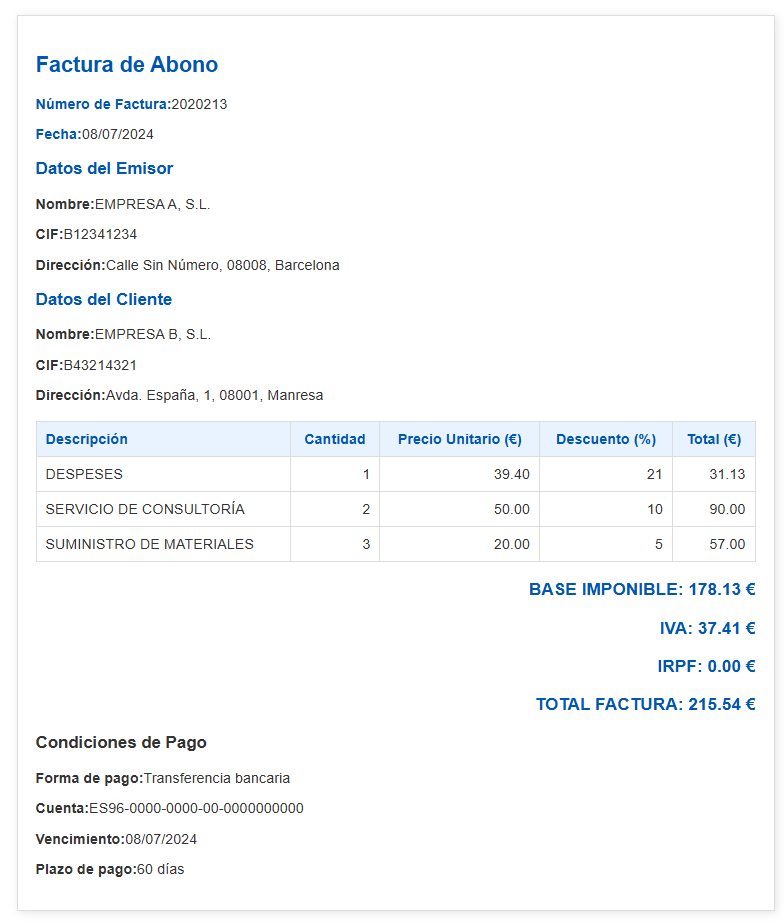

# Proyecto: Transformación de Facturas XML a XHTML con XSLT

## 📌 Descripción
Este proyecto transforma archivos de facturación en formato **FacturaE (XML)** a **XHTML** utilizando hojas de estilo XSLT. Se incluyen dos tipos de facturas:
1. **Factura Electrónica** basada en el estándar **FacturaE**.
2. **Factura de Abono**, con formato detallado para rectificaciones de facturas.

---
## 📁 Estructura del Repositorio

```
📂 xslt-facturas
├── 📄 facturae.xml           # Factura electrónica en formato XML
├── 📄 factrura.xml          # Factura de abono en formato XML
├── 📄 Facturae1.xslt        # Hoja de estilo XSLT para FacturaE
├── 📄 factura4.xslt         # Hoja de estilo XSLT para Factura de Abono
├── 📄 resultado1.xhtml      # XHTML generado desde FacturaE
├── 📄 resultado4.xhtml      # XHTML generado desde Factura de Abono
├── 📄 README.md             # Documento explicativo
```

---
## 🔧 Cómo Ejecutar la Transformación
Para convertir los archivos XML a XHTML, he usado una herramienta en linea:

### **🔹 Herramienta en Línea**
1. Abre [FreeFormatter XSLT Transformer](https://www.freeformatter.com/xsl-transformer.html).
2. Copia y pega el contenido de **facturae.xml** en el campo "Input XML".
3. Copia y pega el contenido de **Facturae1.xslt** en "XSLT Input".
4. Haz clic en **"Transform XML with XSLT"**.
5. Guarda el resultado como **resultado1.xhtml**.
6. Repetir el proceso con **factrura.xml** y **factura4.xslt** para obtener **resultado4.xhtml**.


---
## 📷 Capturas de Pantalla
| Factura Electrónica | Factura de Abono |
|----------------------|------------------|
|  |  |

---
## 📖 Créditos y Referencias
- **Documentación XSLT**: [W3Schools XSLT](https://www.w3schools.com/xml/xsl_intro.asp)
- **Formato FacturaE**: [FacturaE Gobierno de España](https://administracionelectronica.gob.es/ctt/forofacturae)

---
📌 **Autor:** *(Jonathan Alexander Sánchez Rosillo)*  
